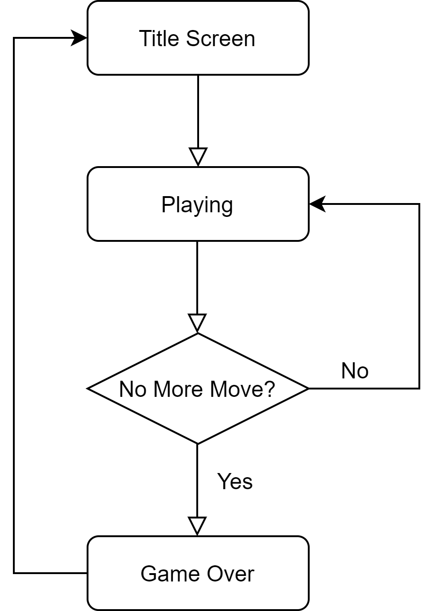

# 2048 (Powered by JavaScript + Phaser)

## Môn học: Đồ họa ứng dụng - CQ2018/23

## Giảng viên hướng dẫn: Phạm Thanh Tùng

## Thông tin nhóm

#### Tên nhóm: Nhóm NC

#### Thành viên nhóm:

| Tên | MSSV | Mail |
| ------------ | ------------- | ------------- |
| Nguyễn Hoàng Chiến | 1712301 | 1712301@student.hcmus.edu.vn |
| Nguyễn Trung Nhân | 18120218 | 1712337@student.hcmus.edu.vn |

## Thông tin đề tài

### Tổng quan
2048 là một game giải đố một người chơi được viết bởi Gabriele Cirulli - một lập trình viên người Ý. 
Mục tiêu của game là trượt các ô sao cho chúng kết hợp với nhau để tạo  thành số 2048. Tuy nhiên, khi đạt được số 2048, người chơi vẫn có thể tiếp tục kết hợp các ô sao cho đạt được giá trị lớn hơn.

#### Cách chơi
Người chơi sẽ sử dụng 4 phím mũi tên hoặc 4 phím W, A, S, D để chơi.

### Chi tiết

#### Flowchart
Một life cycle của game được thể hiện như sau

#### Kiến trúc game
Project sẽ apply các công nghệ sau:
* Phaser 3 - một trong những framework phổ biến nhất hiện nay để lập trình game HTML5
* Vanilla JavaScript

## Các chức năng nâng cao có thể phát triển cho game:
* Nút Pause
* Bảng điểm
* Cho phép người chơi tự upload bài hát để làm nhạc background
* Undo về nước đi trước đó
